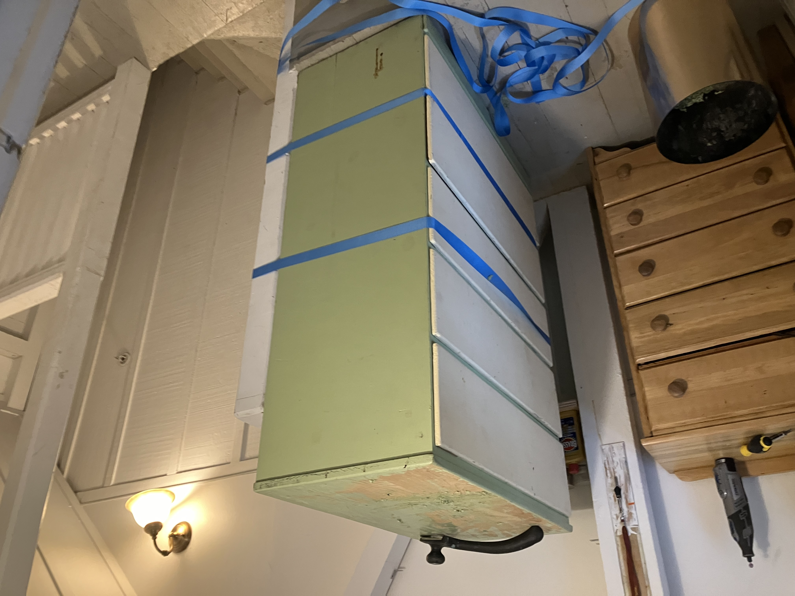
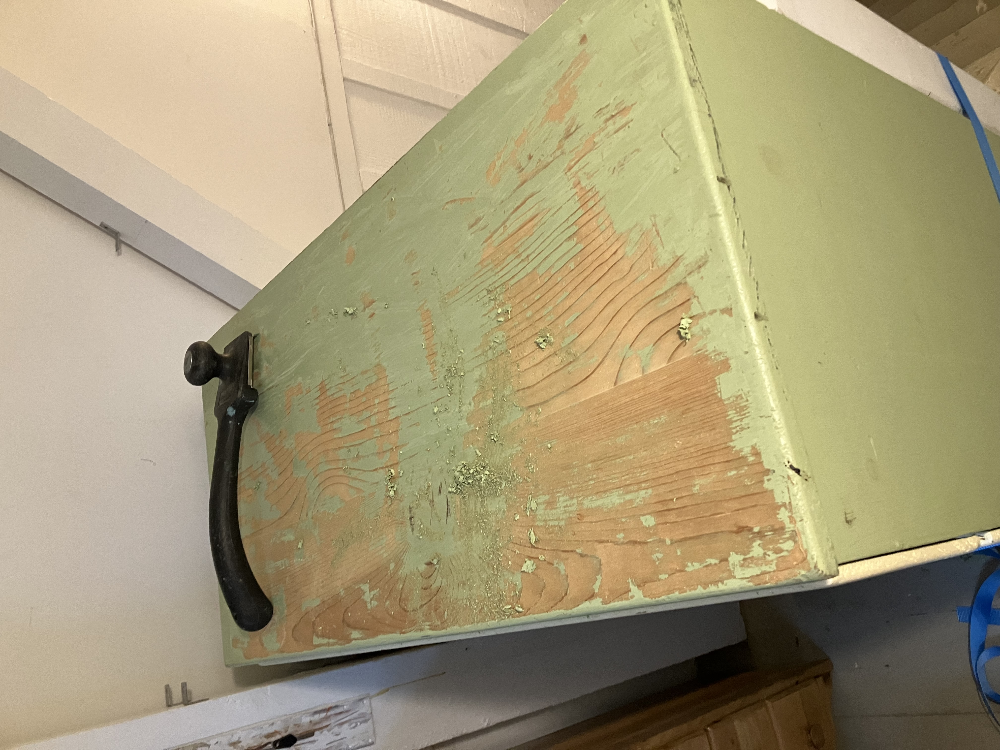
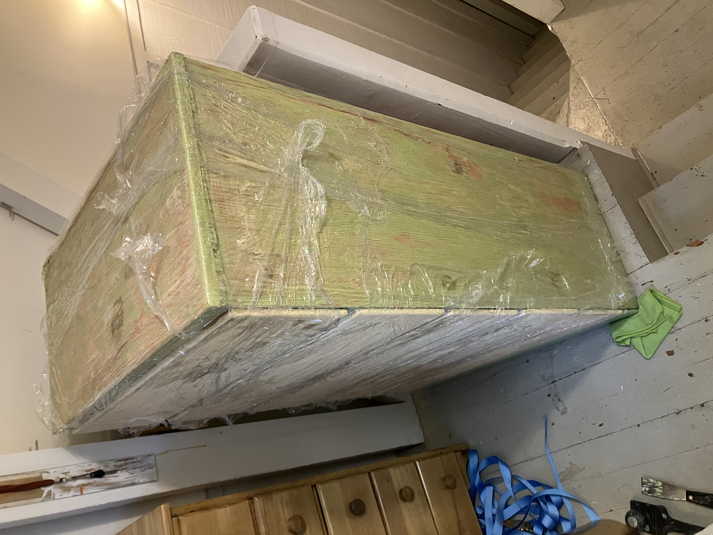
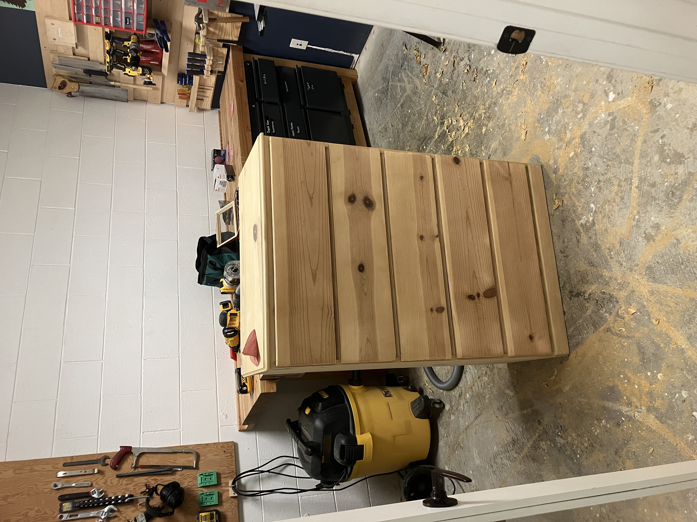
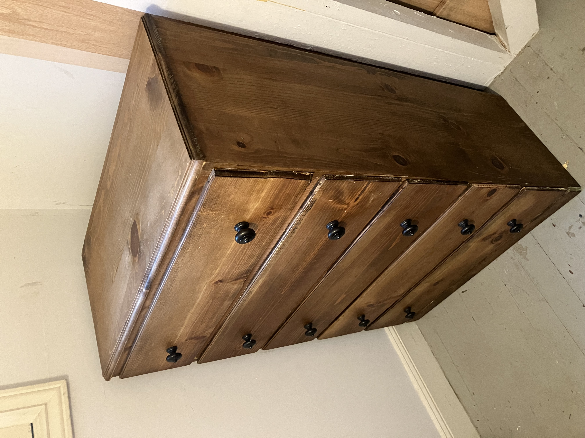

# Chest of Drawers 2
## Refinishing another chest of drawers left on the street in the neighborhood

I've got a thing for street treasure. I wrote up a [similar post](https://dizzard.net/articles/chest_of_drawers/article.html) last year about a chest of drawers I found on the street in a sorry condition. Well, it happened again.

I went down the restoration rabbit hole last week. I think it’s the last time. I appreciate that *other* people are skilled enough to take some ugly dresser and make it beautiful, but the mess is too much for me to handle. I *hate* using chemical strippers, and I hate the cleanup. And for some reason I can’t be bothered to put an apron or some work clothes on, so I ruined multiple pairs of pants in the process. Anyway, here are some before and after shots.

This was right when I got it. There was a just-hatched spider egg on the underside of the chest and I had yet to find that. I know pine is not selected for its natural beauty, but this mucus green color? Yuck 🤮!

I’ve found many dressers on the street (I think this is the third one I’ve brought home), and this one was the lowest quality. No interesting flourishes, cheap wood, friction-fit drawers, etc. But I still liked it enough to take it home. They’re all snowflakes, right?

After several passes with Citristrip, the supposedly friendly paint stripper, I started wrapping it in cellophane to keep the stripper from drying out. This worked mildly better than without, but still a disgusting and messy process.

Now I’m paint free! After most of it was removed with chemical stripper, I hauled it over to [the makerspace](https://sequoiafabrica.org) where I took my trusty RO sander and got to work. Obligatory reminder for readers to always wear a mask and use dust collection!

The tired drawer faces got a face lift. A new profile with the router, and I stacked two round over bits for the top profile. I was pretty satisfied at this point, despite it taking much longer than I’d hoped.

Now with all the old paint cleaned up, a few boxes repaired and those spiders gone, I went about picking a stain and finish.

Now I suppose I could’ve left the pine it’s natural color, and perhaps I should have. But I had a can of Minwax “honey” oil based stain that I wanted to use up. I also considered experimenting with [iron acetate](https://timberbiscuitwoodworks.com/blog/how-to-ebonize-wood).

And I’ll be honest, at this point, I just wanted this project over with. Like I said, I’m over this furniture restoration thing, at least the paint stripping part. So I just wanted a quick and easy stain and finish. After the Minwax stain, I used another can of Minwax brand paste wax (rip [SC Johnson Paste Wax](https://woodworkingadvisor.com/why-was-johnson-paste-wax-discontinued/)) as the sole finish.

I then went digging for some knobs, and I didn't have any at home, so I thought it would be a good opportunity to visit San Francisco's famed [second-hand builder's supply store](https://buildingresources.org/). It's a good visit if you live in the area. Lots of interesting bits and bobs torn off old San Francisco homes.

You can still see some corners where I didn't get all the paint off. 
