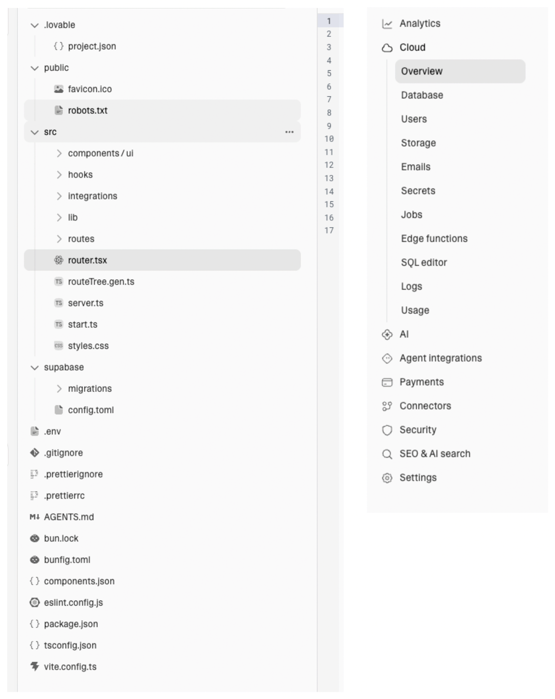
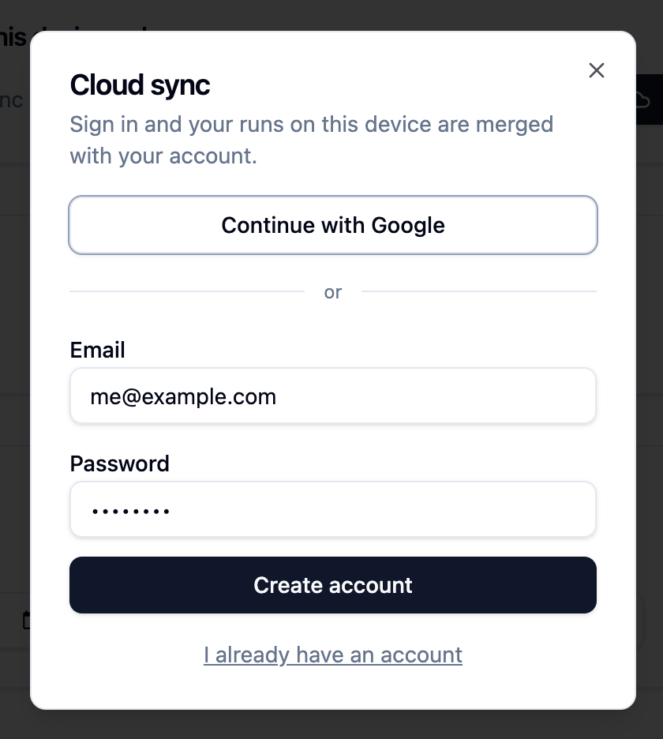

# Small Apps Deserve Simplicity

I am convinced that [personal software](https://www.ajwaxman.com/writing/software-for-one) is the next step for personal computing. We see companies like [val town](https://val.town), and [lovable](https://lovable.com) building prompt-to-app tools so anyone can vibe their way to an app.

That's awesome. Let's say I want to make an app to keep a running tally of my total running distance. Should be easy, let's just pop into Lovable walk through what I'd do.

First, I'll give a prompt to get started:

> Make a run log tracker. I just want to insert the number of miles I've ran every day and see it on a timeline

Alright, nice it looks pretty good.

But when I open it on mobile, none of my data is there. Where did it go?

Oh – I guess Lovable's agent is telling me everything is in localStorage, so nothing is synced. That's alright, I'll ask it to implement cloud sync. Typing that into the chat now and… enter.

OK, I'm waiting for the agent to build cloud sync. This is taking a long time! I thought this would make my life easier! Also why are there so many files and settings for this tiny app? Maybe I should've kept track in a notebook, that might have been easier…

Finally, the agent is done. That took a while, but it looks like it delivered. Now there's a sign-in pop-up. But this all feels a little much! Why do I need a sign-in for such a small app that's just for me? No one else is *ever* going to use this!

Lovable accomplished what I wanted it to. It just doesn't *feel* the way I want it to. Personal software shouldn't require an authentication layer. By its very definition, no one else is going to use it. Instead of making the software more complicated, I want a place to safely run *simpler* software that I completely control. I want to be able to mold software as easy as one could mold a piece of clay. **Personal Software should have weight.** It shouldn't be buried in abstractions, complex cloud deployments or configurations. Imagine if you had to complete a sign-in every time you wanted to write in your pen and paper journal – no thanks!

The fundamental issue I'm picking with apps like Lovable is that they aren't designed around building *personal* software. Instead, they have chosen to focus on customers building *professional* software. Software that lives in a cloud, has generic interfaces that work OK for everyone, but not perfect for anyone. In other words, Lovable just makes it easier to build SaaS. This is an obvious choice for a VC-backed company.

I'm not sure a VC-backed company would or even *could* ever focus on a platform for buildling personal software. It's not as defensible. Selling to businesses is just good business because there's no better way to make money than to help other businesses make more money. A prompt-to-app platform for personal software could, by it's definition, not have the same appeal.

Anyway, all because it's not a billion dollar business doesn't mean we shouldn't have more options for individuals, especially those who aren't software professionals, to build software that benefits their lives on a small, individual scale. I would love to live in a world where more software is local-first, personalized, and simple. We give up so much of our lives to software that we have no say or control over. To bring back to the physicalization analogy, it would be like having Ikea design our entire kitchen, followed by them deciding where ever pan, plate, and knife belongs. Every person's home is completely different, I just want it to be easier for software to feel the same.
